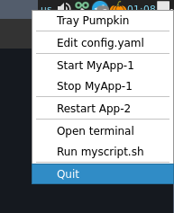
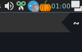

<h1>TrayPumpkin</h1>
 

Fully configurable tray icon and menu.
- Shows a user-defined menu that allows to run custom scripts
- 

Menu             | Tray
:-------------------------:|:-------------------------:
 | 

## config.yaml

## Install

## Icons