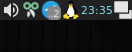

<h1><a href="https://github.com/aceberg/TrayPumpkin">
    
</a>TrayPumpkin</h1>
<br/>

[](https://github.com/aceberg/TrayPumpkin/actions/workflows/binary-release.yml)

Fully configurable tray icon and menu.
- **Icon:** can be changed on command
- **Menu:** shows a user-defined menu that allows to run custom scripts
- **Left click:** runs a command
- **Second Left click (toggle):** runs another command
- Each command can change **Icon** and app **Tooltip**

Menu             | Tray     | User defined icon (Tux)
:-------------------------:|:-------------------------: |:-------------------------:
 |  | 

## Install
There are only packages for `x86_64` arch right now.
### AppImage
`.AppImage` can be downloaded from [latest](https://github.com/aceberg/TrayPumpkin/releases/latest) release. 

### DEB
`.deb` package can be downloaded from [latest](https://github.com/aceberg/TrayPumpkin/releases/latest) release or from my [ppa](https://github.com/aceberg/ppa) repo.
### RPM
`.rpm` package can be downloaded from [latest](https://github.com/aceberg/TrayPumpkin/releases/latest) release. 
### TAR.GZ
1. Install dependencies. The app needs those packages:
```
qt5-qtbase, kf5-knotifications, yaml-cpp
```
2. Download `.tar.gz` archive from [latest](https://github.com/aceberg/TrayPumpkin/releases/latest) release.
3. Unpack
```sh
tar xvzf tray-pumpkin-*-x86_64.tar.gz
```
4. Install
```sh
cd tray-pumpkin-*-x86_64
```
```sh
sudo ./install.sh
```

## Run
```sh
tray-pumpkin
```
By default, the app will look in `~/.config/TrayPumpkin/config.yaml` for config file. If there is none, it will copy default config example there.   
To set another config path, run:
```sh
tray-pumpkin -c /my/path/config.yaml
```

## Config
Each config item has `name`, `cmd`, `icon` and `tooltip`. You can skip some of them, as in the `config.yaml` example:

```yaml
# app config
app:
  name: "Tray Pumpkin"              # App name
  tooltip: "Pumpkin tray utility"   # Dafault tooltip
  icon: "assets/pumpkin-green.png"  # Dafault icon
  cmd: "notify-send 'Tray Pumpkin Started'" # This cmd is optional and runs only at the start

# optional, runs on first left click
left_click:
  cmd: "sh ~/myscript.sh start && notify-send 'Start'"
  icon: "assets/pumpkin-orange.png"
  tooltip: "MyApp"

# optional, runs on second left click
left_click_toggle:
  cmd: "sh ~/myscript.sh stop && notify-send 'Stop'"
  icon: "assets/pumpkin-green.png"
  tooltip: "Pumpkin tray utility"

# optional, runs on quit
quit:
  cmd: "killall xpenguins && notify-send 'All stopped'"

# optional, right click menu
# name and cmd are required for every menu item except separator
menu:
  - name: "Edit config.yaml"
    cmd: "gedit config.yaml"

  - separator: true

  - name: "Start MyApp-1"
    cmd: "sh ~/myscript.sh start && notify-send 'Start'"
    icon: "assets/pumpkin-orange.png"
    tooltip: "MyApp"

  - name: "Stop MyApp-1"
    cmd: "sh ~/myscript.sh stop && notify-send 'Stop'"
    icon: "assets/pumpkin-line.png"
    tooltip: "Pumpkin tray utility"

  - separator: true

  - name: "Penguins Big"
    cmd: "xpenguins --theme 'Big Penguins' -a -b"
    icon: "assets/tux.png"

  - name: "Penguins Stop"
    cmd: "killall xpenguins"
    icon: "assets/pumpkin-green.png"
```

## Build
1. Install dependencies
```sh
apt install -y \
            cmake \
            build-essential \
            qtbase5-dev \
            libkf5notifications-dev \
            libyaml-cpp-dev
```
2. Clone the repo and build
```bash
mkdir -p build
cmake -B build
cd build && make
```
3. Run
```bash
./build/tray-pumpkin -c config.yaml
```

## Icons
<a href="https://www.flaticon.com/free-icons/pumpkin" title="pumpkin icons">Pumpkin icons created by LAFS - Flaticon</a>